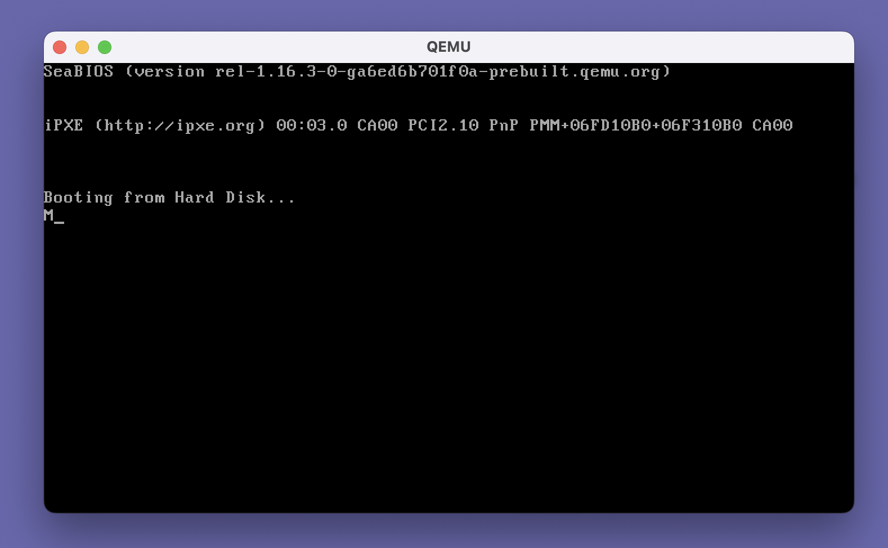

Decided to start building an operating system as a hobby.
Calling it Maya.

Bought a course - [Developing a Multithreaded Kernel From Scratch](https://www.udemy.com/course/developing-a-multithreaded-kernel-from-scratch)

Started the course.

Installed the tools - QEMU, NASM
Coded a simple bootloader in assembly that prints M on the screen.

